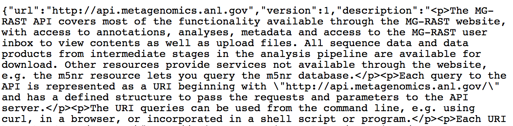
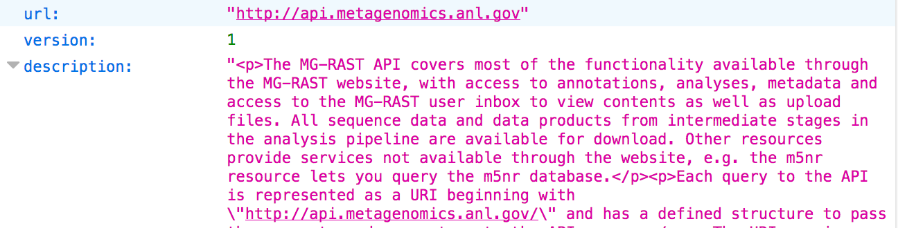
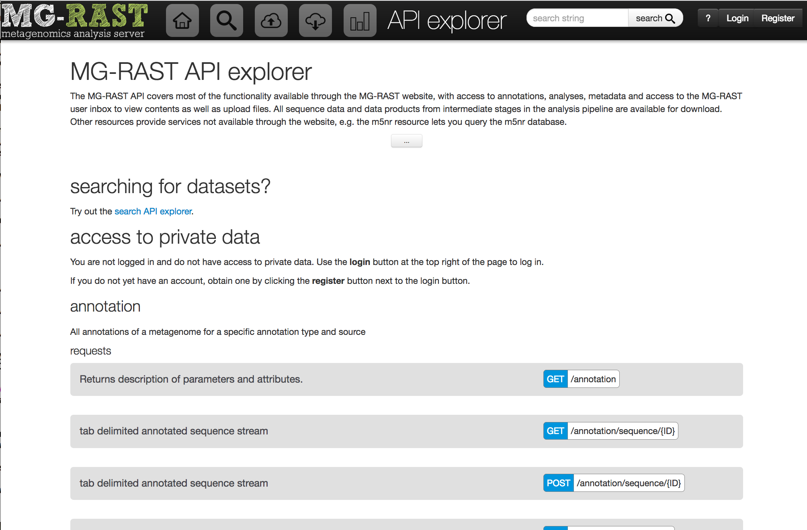

# MG-RAST API

You can get annotation data out of MG-RAST in a handful of ways:
*  from the webpage at https://api.mg-rast.org
*  from the programming interface (API)  directly  http://api.mg-rast.org
*  using the MG-RAST-Tools python scripts to talk to the API http://github.com/MG-RAST/MG-RAST-Tools
*  using the matR R package (which supports read-only access to annotation data)  http://github.com/MG-RAST/matR

The programming interface is the machinery that the webpages use to retrieve the data.

## Jargon
First, some MG-RAST specific jargon:
*  **reads** refer to input (RNA or RNA) sequences, usually uploaded in FASTQ or FASTA format
*  **features** are predicted protein fragments; the pipeline predicts protein fragments from DNA or RNA input data
*  **clusters** are groups of predicted protein fragments that are grouped to reduce computational cost
*  **similarities**  are the result of a search of the clustered proteins against
*  **statistics*  are numbers calculated from a dataset
*  **metadata**  are key=value fields that are populated by the data owner.  This set of fields includes the minimum...
*  **m5nr**  is the database of every protein sequence we can get our hands on.   From time to time MG-RAST downloads protein databases.
*  **annotations** are words, text, or other symbols that are attached in at least one of these databases to a (database) protein sequence.
*  **databases**  refers to the underlying publisher of the protein databases.  JGI, PATRIC, RefSeq, KEGG, EGGNOG, SEED are among the protein data sources.  Different databases have different specialties and scope; your mileage may vary.

## Databases
The protein-sequence databases that we've been using almost always include the name of the source organism for the protein sequence, so for any of the databases that have similarities we can deliver tables of the taxonomic distribution of protein similarity hits.

In addition to taxonomy, some of the protein sequence databases have function data that is organized hierarchically.  For these data sources, we can deliver tables of which protein functions were hit, and can group functions into lower-resolution higher-signal-strength categories.

Many of the proteins that are in our database are in many, if not most of the underlying databases but with
potentially different annotations.  MG-RAST does not curate the annotations, it merely parses them and delivers
them via the webpage or API.

It turns out, there is a URL that will show the list of all the MG-RAST sequence databases:

    http://api.mg-rast.org/m5nr/sources

If you want to get the descriptions of the databases out of JSON in one step, you can use the jq command line tool:

    curl http://api.mg-rast.org/m5nr/sources | jq '.data|.[]|.description'

This extracts the "description" field from the appropriate level of the JSON data:

    "The SEED Project"
    "SILVA Large Subunit rRNA Database"
    "NIH Genetic Sequence Database"
    "evolutionary genealogy of genes: Non-supervised Orthologous Groups"
    "SILVA Small Subunit rRNA Database"
    "Ribosomal Database Project"
    "eggNOG: Non-supervised Orthologous Groups"
    "NCBI Reference Sequences Database"
    "Integrated Microbial Genomes at the Joint Genome Institute"
    "TrEMBL UniProt Knowledgebase"
    "KEGG Orthology"
    "SEED Subsystems Annotation"
    "Non-Redundant Multi-Source Protein Annotation Database"
    "16S rRNA Gene Database"
    "Swiss-Prot UniProt Knowledgebase"
    "Kyoto Encyclopedia of Genes and Genomes"
    "Non-Redundant Multi-Source Ribosomal RNA Annotation Database"
    "eggNOG: Clusters of Orthologous Groups"
    "Pathosystems Resource Integration Center"

## Most API results are in JSON format
The API server is listening at

    https://api.mg-rast.org

and it is designed to deliver data in response to carefully constructed HTTP requests.

If we put `https://api.mg-rast.org` into a browser window, what we see depends a little on what browser we are using.

Some browsers show us a a jumble of text.

If you see a jumble like this, search for browser add-ons or plugins that read JSON and make it look pretty.  (JSONview, JSONviewer, JSONprettyprint)

Once you can pretty-print JSON in your browser, you should see something like this:

This format is called JSON.  You can read about it on [wikipedia](http://en.wikipedia.org/wiki/JSON).
It is a reasonably common format for data of a wide variety of types, similar to XML or YAML.
JSON can encode arrays (ordered lists that are accessed by element number) and objects (key-value pairs where
the key is a string and the value can be a simple data type, an array, or an object.
Note that this is a much more complex a format than fastq or csv.

This looks pretty strange.  This isn't really data, this is someone's idea of how the API should specify what its options and syntax is --to a robot.

These top-level words are the "commands" to access data within the API.

* **darkmatter**  -- retrieves protein fragments that had no similarities (and will not appear downstream)
* **download** -- delivers static data products that include the raw data and the annotation table.
* **inbox**  -- show data about the files that I've uploaded but not processed
* **m5nr**  -- given a database, retrieve annotations for a protein or row
* **matrix** -- return a taxonomy table or a function table in JSON/BIOM format
* **metadata** -- deliver data structures containing user-provided data about the dataset
* **metagenome** --
* **project** -- list metagenomes in a given project, list all projects
* **search**
* sample  -- internal
* compute -- internal.  Crunches numbers for the webserver.
* validation -- internal
* profile -- internal
* library -- internal

Navigate to

    https://api.mg-rast.org/project

and we can see what MG-RAST gives us in response to one of these requests.

There is a top-level field called "requests" that contains an array.  Two items in the array have a field called
"example" , while the first one does not.  The "example" field contains an array with two elements, the first of which
is a URL and the second is a text string describing what the URL does.
This is an example invokation -- a URL that will return something potentially useful.
One of the examples is
https://api.mg-rast.org/project?limit=20&order=name
so let's get that.

This gives us a JSON object that contains a list of the first 20 (public) projects in MG-RAST in alphabetical order.

https://api.mg-rast.org/project/mgp128
Staring at the output in the browser, there is a top-level item called "data" and it contains a numbered list.  The
numbered lists elements are named lists, or key: "value"  pairs.

    https://api.mg-rast.org/project/mgp128?verbosity=full

Each of these commands has parameters, some of which are optional.   Compare the results of the following three URL requests:

    https://api.mg-rast.org/project

    https://api.mg-rast.org/project/mgp128

    https://api.mg-rast.org/project/mgp128?verbosity=full

So now you are probably burning with the question, how do I get this API to do something that I want it to do?
How do I find out what parameters are required for my query?

## The API explorer
Now we are ready to use the [API Explorer](http://www.mg-rast.org/mgmain.html?mgpage=api).

This is a tool we made in late 2017 to help humans ask questions of the API.
For each API call, it displays forms for each of the parameters, and reminds you gently when
one of the required parameters is missing.  Almost all of the required parameters have working
defaults.  You you can build a command-line request with curl,
a command to show the result of the request in a little box in the browser window.

    http://www.mg-rast.org/mgmain.html?mgpage=api

There is separately an [MG-RAST search explorer](http://www.mg-rast.org/mgmain.html?mgpage=searchapi) that
has the ability to construct complex searches:

http://www.mg-rast.org/mgmain.html?mgpage=searchapi

